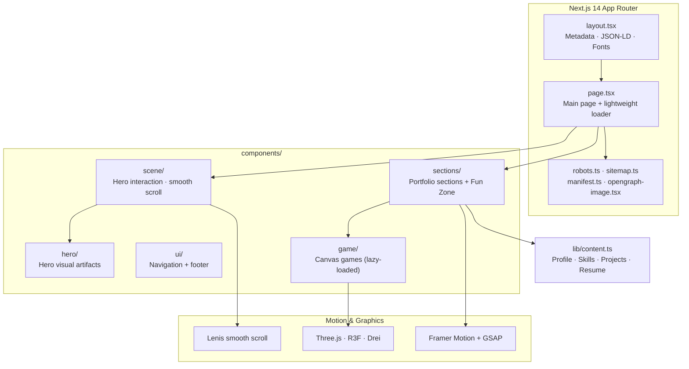
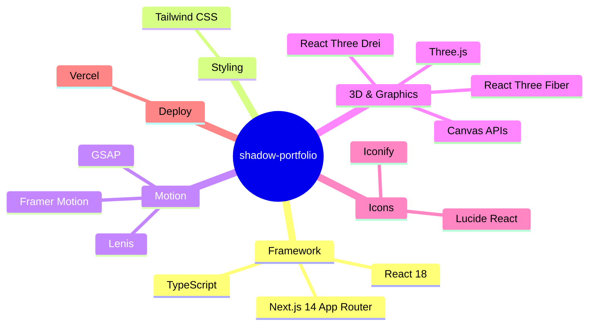

&nbsp;

&nbsp;

# ⚡ BHARAT CHANDRU POOJARI

### Full Stack Developer · Sirsi, Karnataka, India

**"An immersive, performance-focused developer portfolio — a living system archive."**


---


&nbsp;

&nbsp;

---

## 🌌 About The Project

Not just a portfolio — a **cinematic experience**. Built as a dark, atmospheric "living system archive," this site presents my professional experience, skills, projects, education, certifications, and interactive experiments through a fully immersive interface.

```text
> booting shadow-portfolio...
> initializing immersive mode....... [OK]
> pointer parallax................. [OK]
> interactive cannon sequence...... [ARMED]
> smooth scroll (Lenis)............ [ACTIVE]
> fun zone games................... [LOADED ON DEMAND]
> status: OPERATIONAL ⚡
```

### ✨ Key Highlights


|     | Feature                                                                         |
| --- | ------------------------------------------------------------------------------- |
| 🎬  | Cinematic dark visual system with a lightweight startup loader                  |
| 🎯  | Hero interaction with pointer parallax + an interactive cannon sequence         |
| 🕹️ | **Fun Zone** — browser games loaded on demand via dynamic imports               |
| 🧩  | Project showcase with live filtering and project links                          |
| 🌊  | Buttery smooth scrolling with Lenis, motion with Framer Motion &amp; GSAP       |
| 🧊  | 3D and canvas graphics powered by Three.js / React Three Fiber / Drei           |
| 📄  | Structured, centralized content driven from `lib/content.ts`                    |
| 🔍  | Full SEO suite: JSON-LD, sitemap, robots, OG image, favicon                     |
| ⚡   | Performance-conscious rendering with dynamic imports &amp; `content-visibility` |
| ♿   | Reduced-motion support built in                                                 |
| 📱  | Responsive across desktop, tablet, and mobile                                   |


---

## 🖼️ Screenshots


**Live experience → [bharat-poojari.vercel.app](https://bharat-poojari.vercel.app)**

> 🎥 The site is deeply interactive — parallax, motion, and the cannon sequence can only be fully appreciated live. Visit the deployment for the real thing.


---

## 🏗️ System Architecture



### 📦 Dependency Orbit



---

## 🗺️ Project Map

```text
shadow-portfolio/
├── app/
│   ├── layout.tsx              # Global metadata, JSON-LD, fonts, document shell
│   ├── page.tsx                # Main portfolio page + lightweight loader
│   ├── globals.css             # Tailwind layers & global performance styles
│   ├── manifest.ts             # Web app manifest
│   ├── robots.ts               # Robots rules + sitemap declaration
│   ├── sitemap.ts              # XML sitemap
│   ├── opengraph-image.tsx     # Generated 1200×630 social preview
├── components/
│   ├── game/                   # Interactive canvas games (lazy-loaded)
│   ├── hero/                   # Hero visual artifacts
│   ├── scene/                  # Hero interaction & smooth-scroll infra
│   ├── sections/               # Portfolio sections + Fun Zone
│   └── ui/                     # Navigation & footer
├── lib/
│   ├── content.ts              # All portfolio content lives here
│   ├── useCanvasVisibility.ts  # IntersectionObserver visibility helper
│   └── useReducedMotion.ts     # Reduced-motion preference hook
└── public/
    ├── favicon.png             # Static favicon + Apple touch icon
    ├── perfect.png             # Portfolio artwork / portrait
    ├── resume.pdf              # Downloadable resume
    └── google*.html            # Google Search Console verification
```

---

## 🚀 Getting Started

### Requirements


| Requirement | Version |
| ----------- | ------- |
| Node.js     | ≥ 18.17 |
| npm         | ≥ 9     |


### Installation

```bash
git clone https://github.com/bharat-poojari/shadow-portfolio.git
cd shadow-portfolio
npm install
```

### ⚙️ Environment Variables

Create `.env.local` when using a custom domain or Bing verification:

```env
NEXT_PUBLIC_SITE_URL=https://your-domain.com
BING_SITE_VERIFICATION=your-bing-verification-token
```

> `NEXT_PUBLIC_SITE_URL` drives the canonical URL, Open Graph metadata, JSON-LD, sitemap, robots file, and manifest. Falls back to `https://bharat-poojari.vercel.app` when unset.

### Run locally

```bash
npm run dev
```

Open [http://localhost:3000](http://localhost:3000) in a browser.

### 🧰 Scripts


| Command         | Purpose                                    |
| --------------- | ------------------------------------------ |
| `npm run dev`   | Start the development server               |
| `npm run build` | Create and validate the production build   |
| `npm run start` | Start the production server after building |
| `npm run lint`  | Run the Next.js lint command               |


---

## ⚡ Performance Engineering

This project treats performance as a first-class feature:

- 🎮 **Games lazy-loaded** with client-only dynamic imports — zero impact on the initial page bundle
- ⚡ **Lightweight startup loader** disappears after hydration without blocking the page
- 📐 **Pointer parallax** caches layout measurements with `ResizeObserver`
- 👁️ **Below-the-fold sections** use `content-visibility: auto` to defer expensive rendering
- 🖼️ **Hero uses a static background** instead of continuous video decoding
- 🦾 **Reduced-motion preferences** disable continuous animation where appropriate
- ✅ **Production verified** with `npm run build`

---

## 🔍 SEO &amp; Social Preview

The site ships a complete, hand-tuned SEO stack:

- Canonical URL + `en-IN` language metadata
- Google verification support &amp; optional **Bing Webmaster** verification
- `robots.txt` with sitemap location + XML sitemap at `/sitemap.xml`
- Portrait favicon at `/perfect.png` + Open Graph image at `/opengraph-image`
- Twitter large-image card metadata
- **Person, WebSite &amp; portfolio-section JSON-LD** schema

### Post-deploy checklist

- [ ] Set `NEXT_PUBLIC_SITE_URL` to the exact public domain in Vercel
- [ ] Deploy the production build
- [ ] Submit the sitemap in Google Search Console &amp; Bing Webmaster Tools
- [ ] Use URL inspection to request indexing for the homepage
- [ ] Validate the preview with social-platform debugging tools

> Search engines control the final timing of favicon and preview updates — a successful deployment does not guarantee an immediate change in cached results.

---

## ✏️ Content Updates

Most portfolio content is centralized in [`lib/content.ts`](lib/content.ts). Update that file when changing:

- Profile details
- Skills &amp; technology groups
- Featured projects and live links
- Other project links
- Education &amp; certification records
- Contact information

> Keep project links and personal details accurate before deploying.

---

## 🌐 Deployment

Configured for **Vercel** — deploy via dashboard or CLI:

```bash
npm install -g vercel
vercel        # preview deployment
vercel --prod # production deployment
```

Configure environment variables in the Vercel project settings before the production deployment. Verify these endpoints after deployment:

```text
/robots.txt          /sitemap.xml
/manifest.webmanifest
/perfect.png         /opengraph-image
```

---

## 📬 Contact

For collaboration, project opportunities, or technical discussions:


|     | Channel   | Handle                                                                         |
| --- | --------- | ------------------------------------------------------------------------------ |
| 📧  | Email     | [bharatp0316@gmail.com](mailto:bharatp0316@gmail.com)                          |
| 💻  | GitHub    | [bharat-poojari](https://github.com/bharat-poojari)                            |
| 🔗  | LinkedIn  | [Bharat Chandru Poojari](https://www.linkedin.com/in/bharat-poojari-397618359) |
| 📷  | Instagram | [bharat\_x\_16](https://www.instagram.com/bharat_x_16)                         |
| 🌍  | Portfolio | [bharat-poojari.vercel.app](https://bharat-poojari.vercel.app)                 |


---

## 📜 License

This repository does not currently declare a separate open-source license. **Contact the author** before reusing personal branding, portfolio content, artwork, or resume material.

---


### ⚡ Built with obsession by Bharat Chandru Poojari ⚡

```text
   ▄▄▄▄▄▄▄▄▄▄▄▄▄▄▄▄▄▄▄▄▄▄▄▄▄▄▄▄▄▄
  █  SYSTEM STATUS: ONLINE · 200 OK  █
   ▀▀▀▀▀▀▀▀▀▀▀▀▀▀▀▀▀▀▀▀▀▀▀▀▀▀▀▀▀▀
```

[**▲ Back to Top**](#-bharat-chandru-poojari)