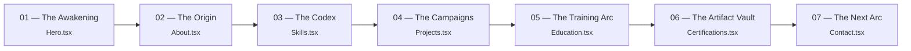
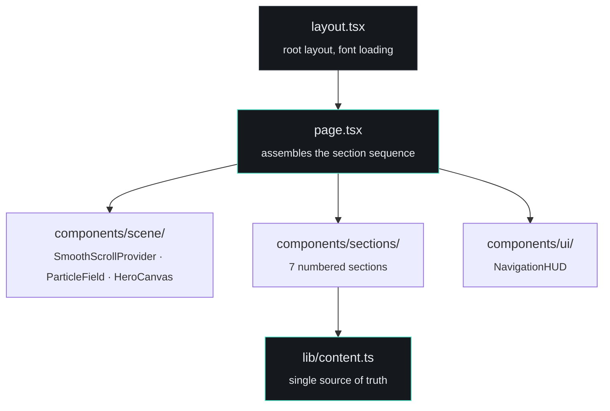
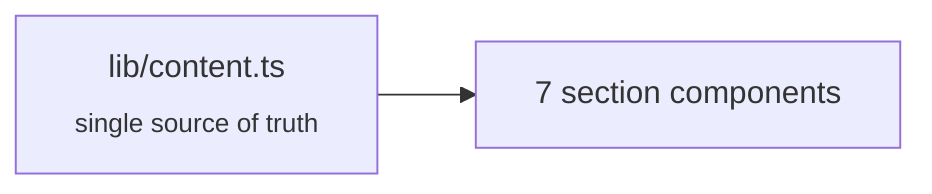

<div align="center">

# ⚡ BHARAT CHANDRU POOJARI

### Full Stack Developer · Sirsi, Karnataka, India

**"An immersive, performance-focused developer portfolio — inspired by the Shadow Monarch."**

<p>


</p>

<p>
<a href="https://bharat-poojari.vercel.app"><strong>Live Demo</strong></a> ·
<a href="https://github.com/bharat-poojari/shadow-portfolio"><strong>Source</strong></a> ·
<a href="public/resume.pdf"><strong>Resume</strong></a> ·
<a href="https://github.com/bharat-poojari/shadow-portfolio/issues"><strong>Issues</strong></a>
</p>

</div>

## Contents

<table>
<tr>
<td valign="top" width="33%">

- [Why This Project Exists](#why-this-project-exists)
- [Project Snapshot](#project-snapshot)
- [Project Status](#project-status)
- [System Experience](#system-experience)
- [Architecture](#architecture)

</td>
<td valign="top" width="33%">

- [Motion & Graphics](#motion--graphics)
- [Accessibility](#accessibility)
- [Design System](#design-system)
- [Featured Work](#featured-work)
- [Content Architecture](#content-architecture)

</td>
<td valign="top" width="33%">

- [Project Structure](#project-structure)
- [Getting Started](#getting-started)
- [Deployment](#deployment)
- [Roadmap](#roadmap)
- [Contact · License](#contact)

</td>
</tr>
</table>

<br>

## Why This Project Exists

This isn't a static resume page — it's a personal portfolio built as a **dark, atmospheric "living archive,"** themed around the Shadow Monarch. Sections aren't just labeled "About" or "Skills" — they're framed as chapters (*The Awakening*, *The Origin*, *The Codex*, *The Campaigns*...), and the site's design tokens (documented directly in `tailwind.config.ts`) carry names — `void`, `ember`, `spectral`, `signal` — tied to what each color is used for rather than generic Tailwind defaults.

The intent: demonstrate frontend engineering (motion, 3D, accessibility, content architecture) through a portfolio that's actually interesting to look at, without pretending the interactive layer is more finished than it is.

<br>

## Project Snapshot

| Area | Implementation |
| :-- | :-- |
| Framework | Next.js `14.2.35` (App Router) |
| Language | TypeScript `5.5.4` |
| UI | React `18.3.1` + Tailwind CSS `3.4.7` |
| Motion | Framer Motion `13.1.0`, GSAP `3.12.5` |
| Smooth scrolling | Lenis `1.1.9` |
| 3D / Graphics | Three.js `0.166.1`, React Three Fiber `8.16.8`, Drei `9.122.0` |
| State | Zustand `4.5.4` |
| Icons | Iconify (`@iconify/react`), Lucide React |
| Content | Centralized in `lib/content.ts` |
| Deployment | Vercel |
| CI / Releases | None configured — deployed directly from `main` |
| License | [MIT](LICENSE) |

<br>

## Project Status

Content is also incomplete in one spot on purpose: the resume lists six independently built applications, but only five are currently named (Furniqo, OffyAI, PrimeNews, CodePolish, and this portfolio). The sixth slot is deliberately left reserved rather than filled with a placeholder.

<br>

## System Experience

`page.tsx` assembles the site as a single sequence:



<br>

## Architecture



**Fonts** are loaded in `layout.tsx`: Space Grotesk (display), IBM Plex Sans (body), JetBrains Mono (data / HUD labels).

<br>

## Motion & Graphics

| Piece | Confirmed role |
| :-- | :-- |
| `SmoothScrollProvider.tsx` | Wraps the page in Lenis inertial scrolling — skipped entirely when the visitor prefers reduced motion |
| `ParticleField.tsx` | A reusable React Three Fiber particle primitive |
| `HeroCanvas.tsx` | The WebGL layer behind the hero ("Awakening") section |
| `NavigationHUD.tsx` | Persistent floating section navigation |
| Framer Motion, GSAP | Present as dependencies; used for UI-level motion today |

> [!NOTE]
> GSAP + ScrollTrigger–driven per-section timelines, and expanding `HeroCanvas` into a persistent scene with its own camera rig, are listed in the project's roadmap rather than shipped yet — see [Roadmap](#roadmap).

<br>

## Accessibility

- `useReducedMotion.ts` — a shared hook used to gate motion behavior across the app
- Lenis smooth scrolling is explicitly skipped under `prefers-reduced-motion`
- `globals.css` defines reduced-motion base rules alongside the design tokens

<br>

## Design System

Color and type decisions are documented directly as comments in `tailwind.config.ts` rather than left implicit:

| Token | Value | Role |
| :-- | :-- | :-- |
| `void` | `#08070B` | Near-black base — the world's default state (not pure black) |
| `ember` | `#B8452E` | Desaturated crimson — projects / energy / action states |
| `spectral` | `#6C5CE0` | Muted violet — AI / system UI / skills-codex states |
| `signal` | `#D9A441` | Warm gold — certifications / verified artifacts |
| `bone` | `#E8E4DD` | Primary text (warm off-white, not pure white) |
| `ash` | `#6B6874` | Secondary text, borders, inactive HUD states |

Each token also ships `dim` / `bright` variants for state changes. A custom `cinematic` easing curve (`cubic-bezier(0.16, 1, 0.3, 1)`) and a `widest2` (0.35em) letter-spacing utility are defined for HUD-style typography. Dark mode is class-based (`darkMode: 'class'`).

<br>

## Featured Work

The Projects section ("The Campaigns") is sourced from the same resume data as the rest of the site:

`Furniqo` · `OffyAI` · `PrimeNews` · `CodePolish` · this portfolio itself

*(A sixth project slot exists in the content model and is reserved rather than filled — see [Project Status](#project-status).)*

<br>

## Content Architecture



Centralizing profile, skills, project, education, and certification content in one file keeps section components focused on presentation rather than data, and makes updates a single-file change.

<br>

## Project Structure

```text
app/
├── layout.tsx        # Root layout, font loading (Space Grotesk / IBM Plex Sans / JetBrains Mono)
├── page.tsx          # Assembles the section sequence (see System Experience)
└── globals.css       # Design tokens, reduced-motion base rules

components/
├── scene/
│   ├── SmoothScrollProvider.tsx   # Lenis inertial scrolling (skipped under reduced motion)
│   ├── ParticleField.tsx          # Reusable R3F particle primitive
│   └── HeroCanvas.tsx             # Hero / "Awakening" WebGL layer
├── ui/
│   └── NavigationHUD.tsx          # Persistent floating section nav
└── sections/
    ├── Hero.tsx             # 01 — The Awakening
    ├── About.tsx            # 02 — The Origin
    ├── Skills.tsx           # 03 — The Codex
    ├── Projects.tsx         # 04 — The Campaigns
    ├── Education.tsx        # 05 — The Training Arc
    ├── Certifications.tsx   # 06 — The Artifact Vault
    └── Contact.tsx          # 07 — The Next Arc

lib/
├── content.ts             # Single source of truth for all resume-grounded content
└── useReducedMotion.ts    # Shared accessibility hook

public/
├── favicon assets
└── resume.pdf
```

<br>

## Getting Started

### Requirements

`Node.js 18.17+` · `npm 9+`

### Install & run

```bash
git clone https://github.com/bharat-poojari/shadow-portfolio.git
cd shadow-portfolio
npm install
npm run dev
```

Open [http://localhost:3000](http://localhost:3000).

### Scripts

| Command | Purpose |
| :-- | :-- |
| `npm run dev` | Start the development server |
| `npm run build` | Production build |
| `npm run start` | Start the production server after building |
| `npm run lint` | Run `next lint` |

<br>

## Deployment

Deployed directly from `main` to **Vercel** — no CI workflow or tagged releases are configured yet.

```bash
npm install -g vercel
vercel        # preview
vercel --prod # production
```

<br>

## Roadmap

**Cinematic engine** (per the project's own §18 / extension-point notes)
- [ ] GSAP + ScrollTrigger timelines per section, mapped to scroll progress
- [ ] `CinematicTransition` primitives: FadeThrough, SlashReveal, GlitchShift, ParticleDissolve, Morph, InkSpread, WorldShift
- [ ] Expand `HeroCanvas` into a persistent scene with its own camera rig, so the 3D world carries across sections instead of resetting

**Content**
- [ ] Fill the reserved sixth project slot once details are available
- [ ] Professional portrait, demo videos/GIFs
- [ ] Additional project metrics and credential verification URLs
- [ ] Personal logo / monogram

> [!NOTE]
> Roadmap items are directional, not scheduled commitments.

<br>

## Contact

<table>
<tr><td>✉️ Email</td><td><a href="mailto:bharatp0316@gmail.com">bharatp0316@gmail.com</a></td></tr>
<tr><td>💻 GitHub</td><td><a href="https://github.com/bharat-poojari">bharat-poojari</a></td></tr>
<tr><td>🔗 LinkedIn</td><td><a href="https://www.linkedin.com/in/bharat-poojari-397618359">Bharat Chandru Poojari</a></td></tr>
<tr><td>📷 Instagram</td><td><a href="https://www.instagram.com/bharat_x_16">bharat_x_16</a></td></tr>
<tr><td>🌍 Portfolio</td><td><a href="https://bharat-poojari.vercel.app">bharat-poojari.vercel.app</a></td></tr>
</table>

<br>

## License

This project is licensed under the [MIT License](LICENSE).

> The full license text is available in the repository root at [LICENSE](LICENSE).

<br>

<div align="center">
<sub>Bharat Chandru Poojari · Full Stack Developer · Sirsi, Karnataka, India</sub>
</div>
